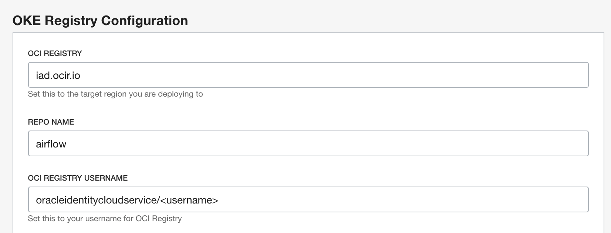
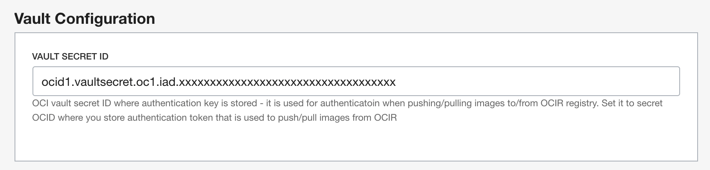

   
  <h1>Apache Airflow on OCI OKE</h1>
   

This quickstart template deploys [Apache Airflow](https://airflow.apache.org/) on [Oracle Kubernetes Engine (OKE)](https://docs.oracle.com/en-us/iaas/Content/ContEng/Concepts/contengoverview.htm).  

# Pre-Requisites
Airflow on OKE depends on use of [Instance Principals](https://docs.oracle.com/en-us/iaas/Content/Identity/Tasks/callingservicesfrominstances.htm) for DAG execution.  You should create a [dynamic group](https://docs.oracle.com/en-us/iaas/Content/Identity/Tasks/managingdynamicgroups.htm) for the compartment where you are deploying your Airflow OKE cluster.  In this example, I am using a [Default Tag](https://docs.oracle.com/en-us/iaas/Content/Tagging/Tasks/managingtagdefaults.htm) for all resources in the target compartment to define the Dynamic Group:

    tag.Airflow.InstancePrincipal.value='Enabled'

After creating the group, you should set specific [IAM policies](https://docs.oracle.com/en-us/iaas/Content/Identity/Reference/policyreference.htm) for OCI services which you want Airflow to integrate with. 

**Due to enforcement of [OSMS](https://docs.oracle.com/en-us/iaas/os-management/osms/osms-getstarted.htm) for compute resources created using an `manage all-resources` policy, you need to specify each service in a separate policy syntax**

At a minimum, the following policies are required - in this example both the Dynamic Group and target Compartment are "Airflow":

    Allow dynamic-group Airflow to manage cluster-family in compartment Airflow
    Allow dynamic-group Airflow to manage secret-family in compartment Airflow
    Allow dynamic-group Airflow to manage vaults in compartment Airflow

The above will allow the Airflow OKE cluster to leverage [KubernetesExecutor](https://airflow.apache.org/docs/apache-airflow/stable/executor/kubernetes.html).  This spins up containers in worker pods on-demand for DAG execution, so there is no need for any persistent infrastructure beyond the Bastion host used to access the cluster, and the webserver & scheduler containers in the Airflow pod.  

Common integrations include Object Storage, Autonomous Database, and Data Flow.   Here are policy statements for those related services:

    Allow dynamic-group Airflow to manage object-family in compartment Airflow
    Allow dynamic-group Airflow to manage autonomous-database-family in compartment Airflow
    Allow dynamic-group Airflow to manage dataflow-family in compartment Airflow

Also required prior to deployment are an [OCI Registry](https://docs.oracle.com/en-us/iaas/Content/Registry/Concepts/registryoverview.htm), [OCI Vault](https://docs.oracle.com/en-us/iaas/Content/Registry/Concepts/registryoverview.htm), [Auth Token](https://docs.oracle.com/en-us/iaas/Content/Identity/Tasks/managingcredentials.htm#create_swift_password), and a [Vault Secret](https://docs.oracle.com/en-us/iaas/Content/KeyManagement/Tasks/managingsecrets.htm) which contains the Auth Token.  

**The OCI registry must be in the tenanacy root and the user account associated with the auth token will need relevant privileges for the repo**

This policy syntax is as follows, assuming the user is in a group "RepoAccess"

    Allow group RepoAccess to manage repos in tenancy

You will need to gather the repo name, and user login to access the registry.  You will also need to configure the registry field to the region where your registry is deployed.

Note that in this example the registry username uses [Oracle Cloud Identity Service Federation](https://docs.oracle.com/en-us/iaas/Content/Identity/Tasks/federatingIDCS.htm).  If you are not using IDCS and using a local account, simply use the local account login (email address).

The auth token is fetched from OCI Vault Secrets - you will need to capture the secret OCID prior to deployment.

# Deployment
The main branch of this deployment uses [Oracle Resource Manager](https://docs.oracle.com/en-us/iaas/Content/ResourceManager/Concepts/resourcemanager.htm).  The shell branch uses stand-alone Terraform (CLI).   

This template deploys the following:

* Virtual Cloud Network
  * Public Subnet
  * Private Subnet
  * Internet Gateway
  * NAT Gateway
  * Service Gateway
  * Route tables
  * Security Lists
    * TCP 22 for Edge SSH on public subnet
    * Ingress to both subnets from VCN CIDR
    * Egress to Internet for both subnets
    * Ingress to var.service_port - default 8080 for Airflow UI
* OCI Virtual Machine Bastion Instance
* OCI MySQL as a Service for Airflow Metadata
* OKE Cluster
  * Webserver container
  * Scheduler container 

Simply click the Deploy to OCI button to create an ORM stack, then walk through the menu driven deployment.  Once the stack is created, use the Terraform Actions drop-down menu to Plan, then Apply the stack.

## Deployment Architecture Diagram

The Bastion host is deployed to the public subnet and used to access the OKE cluster.   It is also leveraged in the build process, as remote-execution is used to drive Docker image build followed by push to OCI Registry then  OKE deployment.

## OKE
Load balancer service is included in the OKE cluster deployment for access to the Airflow Web UI on port 8080.  Once the cluster is built you can find the public IP by issuing the command:

    kubectl -n airflow get svc

You should see similar output:

    NAME      TYPE           CLUSTER-IP     EXTERNAL-IP       PORT(S)          AGE
    airflow   LoadBalancer   10.96.187.11   129.146.222.217   8080:32300/TCP   74s

The deployment on OKE produces an Airflow pod which has a Webserver and a Scheduler container.  DAG execution using KubernetesExcutor will spin up new pods for each worker task, along with associated containers to drive execution.  You can see the pods using the following command:

    kubectl -n airflow get pods -o wide

You should see similar output:

    NAME                       READY   STATUS     RESTARTS   AGE   IP            NODE       NOMINATED NODE   READINESS GATES
    airflow-75f45994f5-ll2rz   2/2     Init:0/1   0          76s   10.244.0.17   10.0.2.5   <none>           <none>

You can drill into additional detail by issuing the command using the pod name from the previous command:

    kubectl -n airflow  describe pod/airflow-75f45994f5-ll2rz

## OCI FSS
OCI File Storage Service is used to provide a fault tolerant, highly available shared filesystem where Airflow DAGS and Log data are stored.  This filesystem is automatically mounted on OKE containers in `/opt/airflow/dags` and `/opt/airflow/logs`.

You may also want to mount this on the Bastion host for ease of access - by default this is only mounted on OKE cluster containers.  In this example the FSS export IP is set to 10.0.2.3.

    sudo mkdir -p /opt/airflow/dags
    sudo mkdir -p /opt/airflow/logs
    sudo mount -o nosuid,resvport 10.0.2.3:/airflow-dags/ /opt/airflow/dags/
    sudo mount -o nosuid,resvport 10.0.2.3:/airflow-logs/ /opt/airflow/logs/

## OCI MySQL
OCI MySQL service is used to store Airflow Metadata.  You can configure elements of the MySQL deployment, most importantly is ensuring the internal IP address is in scope with the OKE cluster subnet should you choose to deploy this to an existing VCN/Subnet topology.

## *Important Note*
It's important to note that you *must delete the airflow service* before you attempt to execute a Terraform destroy either via ORM or CLI.   To do this, login to the bastion host and execute the following command:

    kubectl -n airflow delete -f /home/opc/airflow/build/airflow.yaml

This will remove the airflow service, and allow for graceful termination of related stack elements upon Terraform destroy.

